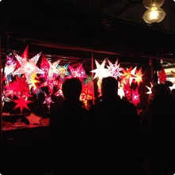
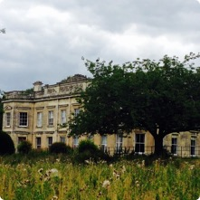
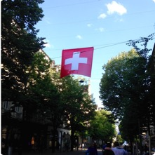
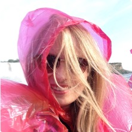

 

###An Enthusiastic Public Speaker
Passionate about science and wellbeing, I regularly engage in public speaking to communicate the latest interesting research into wellbeing in a simple, jargon-free way. Please see the page 'Public Speaking' for more information.

 

###An Avid Travelling
Outside of the lab, I frequently travel solo across continents.

To pursue my fascination with mindfulness, I volunteered and studied meditation at a Buddhist monastery in England and dream of trekking through Nepal in the future. A keen interest in the German language has led me on multiple occasions through Germany and surrounding regions, inter-railing and volunteering, and once to assist an Austrian family in Toronto, Canada.

One of my latest adventure saw me tour through Italy with friends, taking in Rome, Tuscany and Umbria.

Having just put down my backpack from an academic adventure at the [Univeristy of Amsterdam](http://www.uva.nl/en/home), I am currently planning a future trip to Japan.

 

 
 