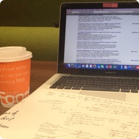

 

##Academic Experience

*I achieved a First Class BSc Hons Psychology at the University of Glasgow in 2017.*

Throughout my undergraduate degree, I developed a broad scope of knowledge for psychology as well as detailed understanding in areas of ageing, atypical development, social cognition and positive psychology. In recognition for my efforts not only in Psychology, but across all my additional courses, I received awards and prizes, including bursaries from the School of Modern Languages and Cultures and the School of Physics and Astronomy. 
 

*Returning to Glasgow as a postgraduate, my MSc studies in the Research Methods of Psychological Science has challenged me to become a better researcher...*

Through the course, I have enhanced my R coding proficiency and enhanced my knowledge of both quantitative and qualitative research methods, in addition to brain imaging techniques. Having being interested in mindfulness through both personal experience and my undergraduate course, I am enthusiastic to be running my own Masters project into the effects of mindfulness on behaviour.

###Additional Experience
#### A Peaceful Mind: Mindfulness and Compassion-based Interventions
I am currently completing a course on the science of mindfulness and compassion at the [Univeristy of Amsterdam](http://www.uva.nl/en/home). I am thrilled to be extending my knowledge of the subject amongst like-minded researchers and esteemed academics and professionals in the field.

 

###Awards and Honours
* 2013 – Psychology Merit Award: excellent performance in Psychology course, awarded by the School of Psychology, University of Glasgow

* 2013 – Tannahill Bequest: first in class for Astronomy course, awarded by the School of Astronomy and Physics, University of Glasgow

* 2013 – Lanfine Bursary: excellent performance in Advanced German course, awarded by the School of Modern Languages and Cultures, University of Glasgow

 

###Presentations
* 2017 - Guest Speaker in Positive Psychology Module within BSc Hons Psychology at University of Glasgow - *Mindfulness*: a presentation sharing my own personal experience with mindfulness meditation practice, providing discussion points to tie in with course topics and leading a group meditation exercise.