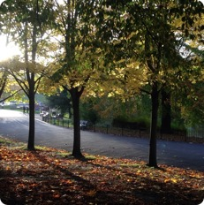

 

##Research Experience

Having recently graduated from the University of Glasgow in 2017, I work with [Prof. Lawrence Barsalou](https://www.gla.ac.uk/schools/psychology/staff/lawrencebarsalou/) on extending my dissertation project on the role of factors within and beyond self-control on influencing habitual behaviours, alongside pursuing my Masters degree. 

I have worked and studied across Europe, undertaking a ERASMUS research assistantship during the summer of 2016 at the University of Tübingen, Germany in partnership with the [Leibniz-Institut für Wissensmedien](https://www.iwm-kmrc.de/www/index.html). Here I assisted [Dr. Hauke Meyerhoff](https://www.iwm-tuebingen.de/www/personen/ma.html?uid=hmeyerhoff) on investigations into the importance of auditory information in visual learning. 

Although I have interests spanning many areas including cognition, cultures and religion, my current work focuses on habitual behaviours, particularly effects of mindfulness and meditation on behavioural experience. 

###Interdisciplinary Work
Behaviour change is an field of research that has an incredible ability to contribute to many areas of lived experience.
I currently pursue the interdisciplinary application of mindfulness in Computing Science, often attending Computing Science and Education reading groups.

 

###Professional Memberships

* 2017 – Graduate Member of the British Psychological Society (MBPsS)

* 2013 – Student Member of the British Psychological Society

 

###Conferences Attended

* 2017 – BPS Scottish Undergraduate Conference, University of Edinburgh, Scotland

* 2015 – BPS Scottish Undergraduate Conference, University of Strathclyde, Scotland

