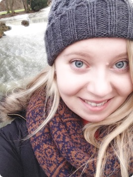

 

 My name is Naomi and I am a research assistant at the Univeristy of Glasgow, working as part of an interdisciplinary team at the [Centre for Computing Science Education, School of Computing Science](https://www.gla.ac.uk/research/az/ccse/).

I've recently completed my Masters in Research Methods of Psychological Science at the University of Glasgow within the [Institute of Neuroscience and Psychology](http://www.gla.ac.uk/researchinstitutes/neurosciencepsychology/) with [Prof. Lawrence Barsalou](https://www.gla.ac.uk/schools/psychology/staff/lawrencebarsalou/) on the effects of mindfulness on habitual behaviours.

I am a member of the [British Psychological Society](http://beta.bps.org.uk).

 

###My Current Research Interests

Although I have interests spanning many areas including cognition and clinical psychology, my current work focuses on mindfulness, with an emphasis on understanding its impact on student wellbeing, behaviour and learning.

* Habitual Behaviours
    * Behaviour Change
    * Intention-Behaviour Gap
    * Mindfulness-Based Behaviour Interventions
    * Health Behaviour

* Mindfulness
    * Issues in the Definition of Mindfulness
    * Meditation, both formal and informal
    * Self-Compassion
    * Impact on Cognition
    
* Self-Control
    * Grit
    * Role of Conflict
    * Interactions with Reward