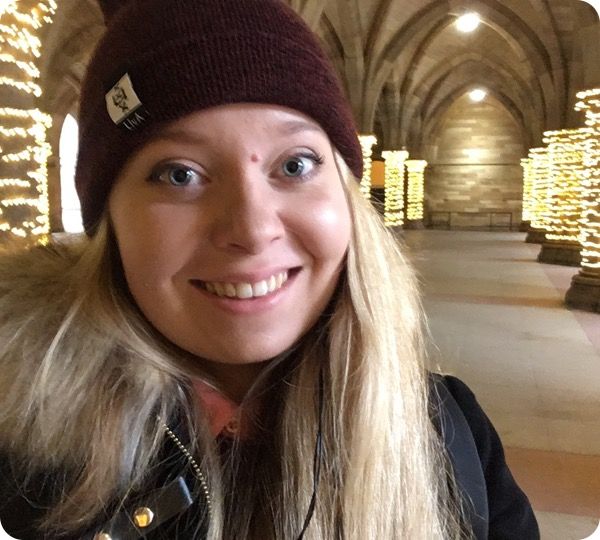

 

 My name is Naomi and I am an honorary research assistant at the Univeristy of Glasgow, working as part of an interdisciplinary team at the [Centre for Computing Science Education, School of Computing Science](https://www.gla.ac.uk/research/az/ccse/).

In 2018, I completed my Masters in Research Methods of Psychological Science at the University of Glasgow within the [Institute of Neuroscience and Psychology](http://www.gla.ac.uk/researchinstitutes/neurosciencepsychology/) with [Prof. Lawrence Barsalou](https://www.gla.ac.uk/schools/psychology/staff/lawrencebarsalou/) on the effects of mindfulness on habitual behaviours.

 

###My Research Interests

Although I have interests spanning many areas including cognition and clinical psychology, my current work focuses on mindfulness and behaviour change and well-being.

* Mindfulness
    * Issues in the Definition of Mindfulness
    * Meditation
    * Self-Compassion
    * Impact on Well-Being
    * Physiological Impact of Mindfulness
 

* Habitual Behaviours
    * Behaviour Change
    * Intention-Behaviour Gap
    * Mindfulness-Based Behaviour Interventions
    * Health Behaviour
    * Self-Control
 
    
* Digital and Clinical Applications
    * mHealth and Wearable Technologies (incl. Neurofeedback)
    * Neurorehabilitation
    * Chronic Illness and Recovery
 