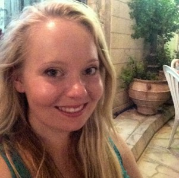

 My name is Naomi and I am a postgraduate student at the University of Glasgow within the [Institute of Neuroscience and Psychology](http://www.gla.ac.uk/researchinstitutes/neurosciencepsychology/).
I’m currently working towards my Masters in Research Methods of Psychological Science with [Prof. Lawrence Barsalou](https://www.gla.ac.uk/schools/psychology/staff/lawrencebarsalou/) on the effects of mindfulness on habitual behaviour change. 

I am a member of the British Psychological Society.

##Research Experience

Having recently graduated from the University of Glasgow in 2017 with a First in BSc Psychology, I work with [Prof. Barsalou](https://www.gla.ac.uk/schools/psychology/staff/lawrencebarsalou/) on extending my dissertation project on the role of factors within and beyond self-control on influencing habitual behaviours, alongside undertaking my Masters. 

I have additionally worked internationally, undertaking a research assistantship during the summer of 2016 at the University of Tübingen, Germany in partnership with the Institut für Wissensmedien, assisting [Dr. Hauke Meyerhoff](https://www.iwm-tuebingen.de/www/personen/ma.html?uid=hmeyerhoff) on investigations into cognitive learning strategies. 

Although I have broad interests spanning many areas, my current work focuses on habitual behaviours and their interventions, as well as the effects of mindfulness and meditation on both behavioural and psychological experience. 

##Academic Experience

I completed my BSc Hons Psychology at the University of Glasgow in 2017 and achieved a First. Throughout my undergraduate degree, I developed a broad scope of knowledge for psychology as well as detailed understanding in areas of ageing, atypical development, social cognition and positive psychology. In recognition for my efforts not only in Psychology, but across all my additional courses, I received awards and prizes, including bursaries from the School of Modern Languages and Cultures and the School of Physics and Astronomy. 

Returning to Glasgow as a postgraduate, the Masters in Research Methods of Psychological Science is challenging me to become a better researcher, allowing me to develop fluency with R coding, as well as knowledge of various research methods, both cognitive and qualitative focused, and brain imaging techniques. Having being interested in mindfulness 
through both personal experience and my undergraduate course, I am thoroughly enthusiastic about running my own Masters project.

###My Current Research Interests
* Habitual Behaviours
    * Implementation Intentions
    * Intention-Behaviour Gap
    * Mindfulness Behaviour Interventions
    * Motivational Interviewing

* Mindfulness
* Self-Control
    * Grit
    * Role of Conflict

##About Me
I am a keen international solo traveller. My interests fuel my travels; my fascination with the German language has led me on many occasions to Germany, inter-railing and volunteering, and my interest in mindfulness steered me into studying meditation at a Buddhist monastery in England.

   
##Contact
     Please feel free to get in touch...

:envelope: email :
TBC

:baby_chick: twitter
TBC

[LinkedIn Profile](https://www.linkedin.com/in/naomi-clark-869500114/)
